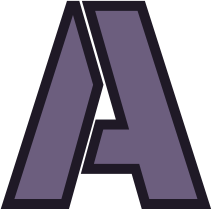

# Accord

accord is a Social app such as Discord or Slack.

## Requirements

* [NodeJS 13.9.0+](https://nodejs.org/en/)
* [Yarn 2 (Berry)](https://yarnpkg.com/getting-started/install)

## How to run from Source

```s
~$ git clone https://github.com/accord-app/accord-app.git
~$ cd accord-app
~$ yarn
~$ yarn start
```

## How to Build from Source

```s
~$ git clone https://github.com/accord-app/accord-app.git
~$ cd accord-app
~$ yarn
~$ yarn build
```

## License

Accord's code is licensed under the [MIT licence](https://opensource.org/licenses/MIT). Please see [the licence file](./LICENSE) for more information. [tl;dr](https://tldrlegal.com/license/mit-license) you can do whatever you want as long as you include the original copyright and license notice in any copy of the software/source.
